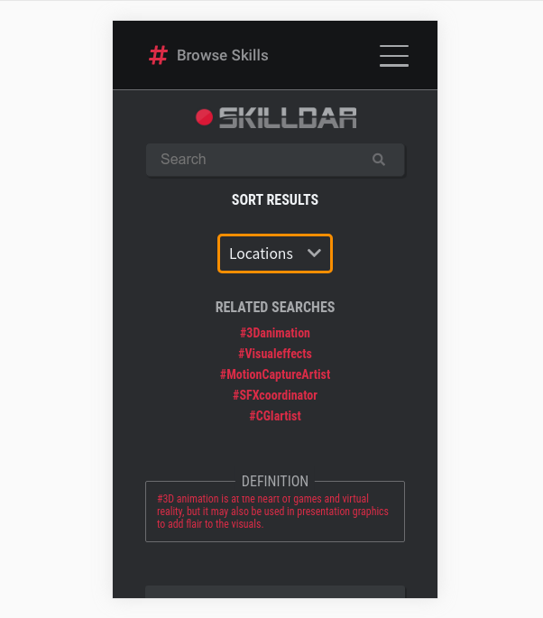
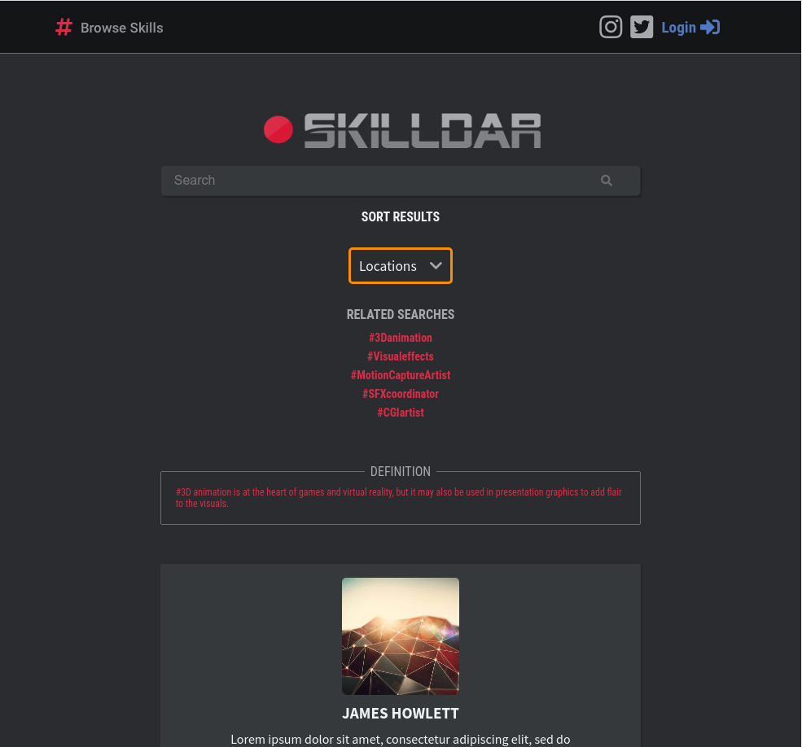
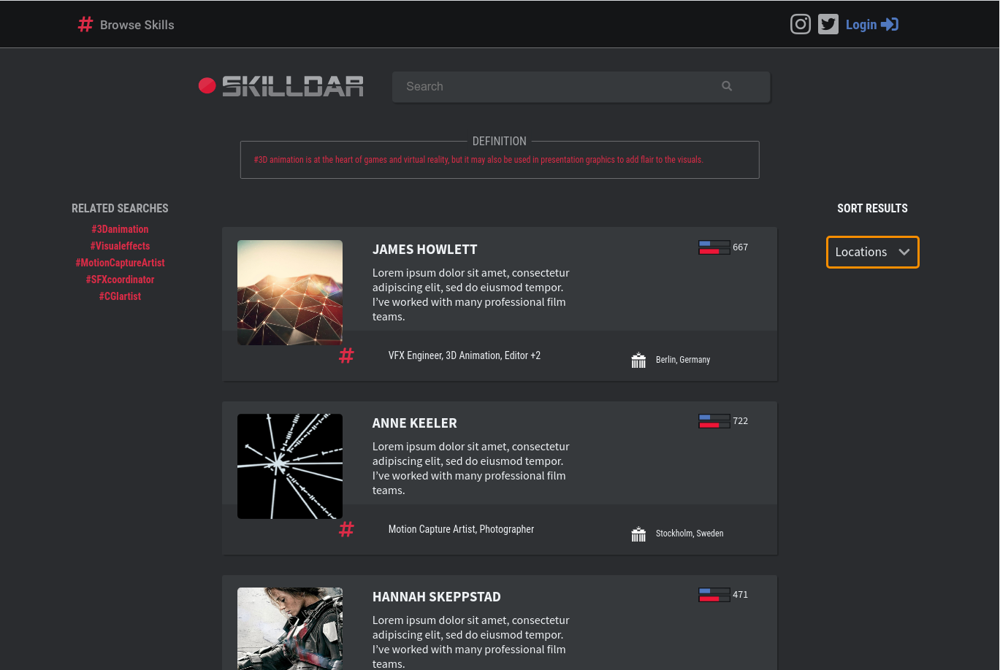
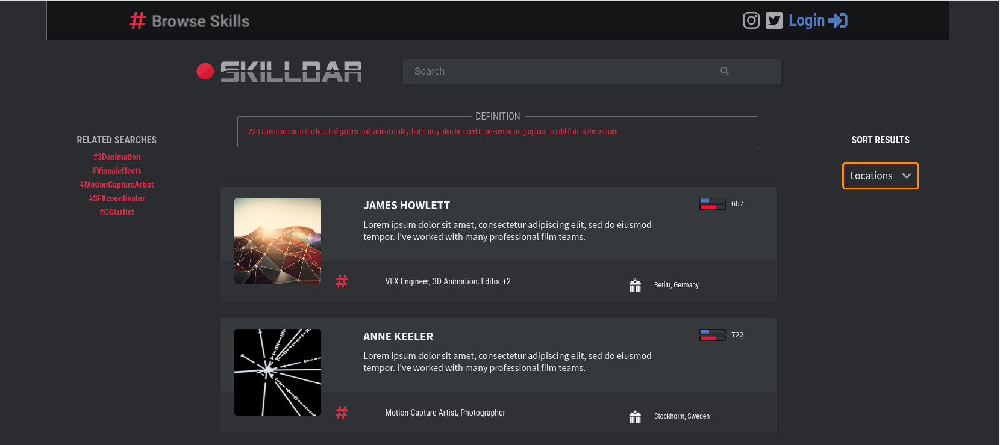
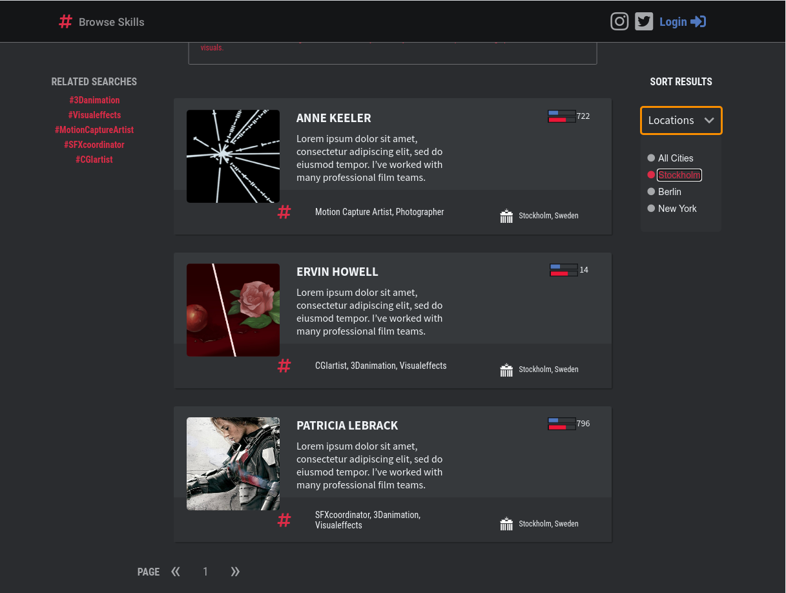
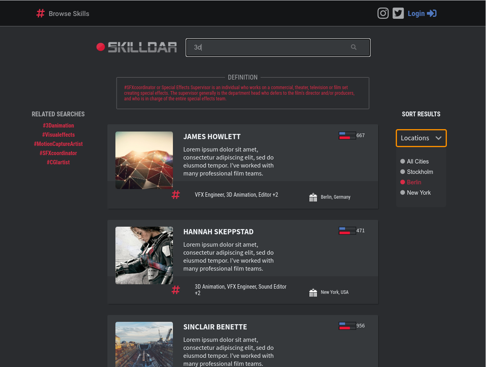
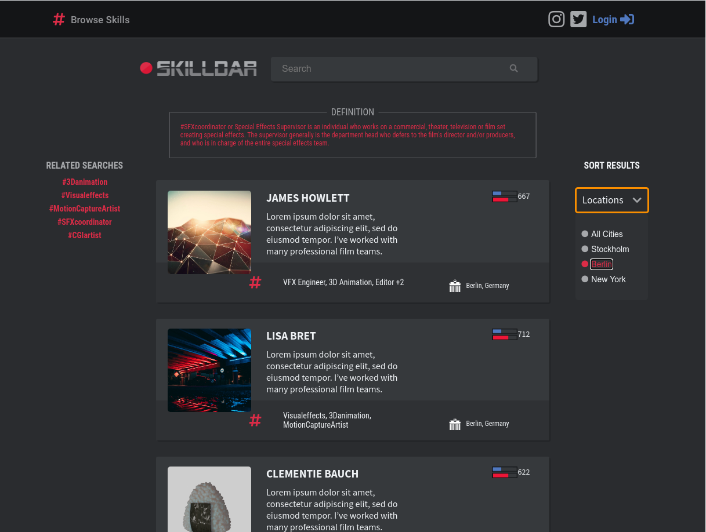

This project was bootstrapped with [Create React App](https://github.com/facebook/create-react-app).

## Script to start up the app

In the project directory, you can run:

### `yarn start`

Runs the app in the development mode. 
Open [http://localhost:3000](http://localhost:3000) to view it in the browser.

The page will reload if you make edits. 
You will also see any lint errors in the console.

## Layout

This single page app has a responsive layout

## Functionality

Search by sorting locations

Search by letters or keywords

Updating definition of each category

